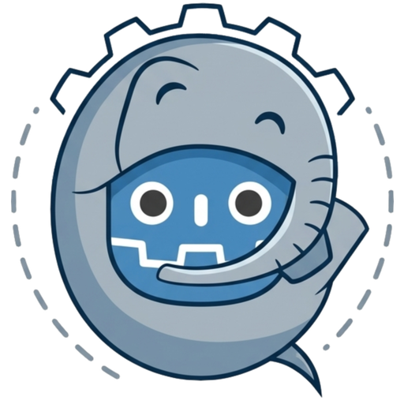
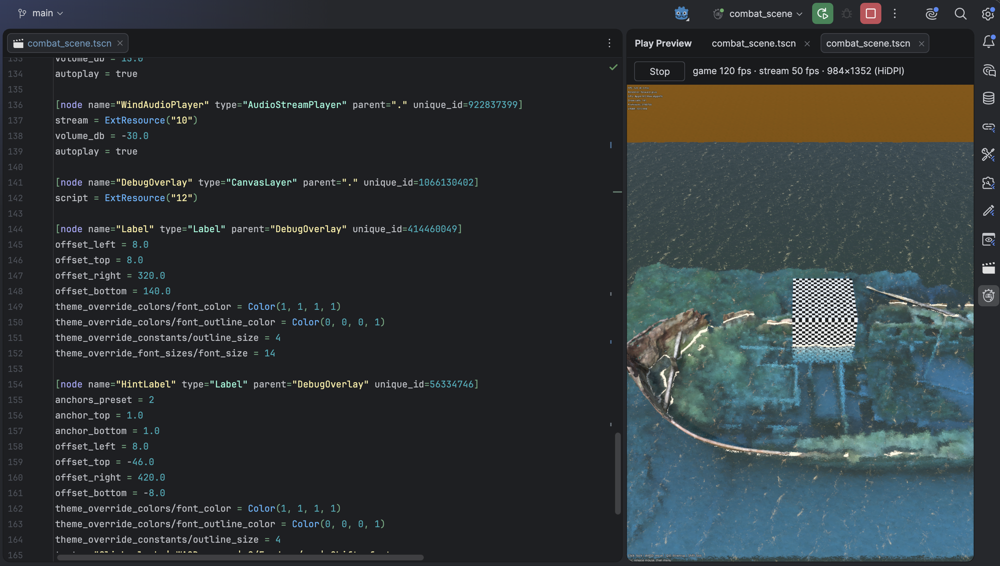

<p align="center">
  
</p>

<h1 align="center">Godot Embed Play</h1>

<p align="center">
  Play your Godot 4 scenes inside Rider, IntelliJ IDEA and every other JetBrains IDE.<br>
  No extra game window: the scene runs in a dockable tool window next to your code.
</p>

<p align="center"><i>Created by Sleepyfant Software</i></p>

---

<p align="center">
  
</p>

## Features

- **Run any scene from the IDE.** A *Godot Scene* run configuration, or right-click a `.tscn` → **Run**.
  Your own launcher scripts work too.
- **The full renderer.** Forward+, Vulkan or Metal, compute shaders and all. Godot renders exactly as it
  normally does; the frames stream into the IDE.
- **Follows the panel.** Resize or re-dock the *Play Preview* tool window and the game viewport follows,
  honouring your project's stretch settings. Sharp on HiDPI and Retina screens.
- **Hover-based input.** Point at the game and the mouse and keyboard go to it. Move away and your editor
  has them back. Drag gestures continue outside the panel, and the cursor returns to where you pressed.
- **Windowless on macOS.** No stray Godot window, no Dock icon, and a game that captures the mouse can't
  take over your cursor.
- ⚠️ **Breakpoints through the Godot editor (experimental).** With the editor's debug server open, breakpoints and stepping
  work through Rider's GDScript debugger, and the view shows a pause overlay while the game is stopped.

## Planned features

- [x] Run any Godot 4 scene inside an IDE tool window, from a run configuration or a right-click on a `.tscn`
- [x] Full renderer: Forward+, Vulkan or Metal, compute shaders included
- [x] Viewport follows the panel size and the project's stretch settings, sharp on HiDPI
- [x] Hover-based mouse and keyboard input, with drag gestures that continue outside the panel
- [x] Windowless mode on macOS: no Godot window, no cursor capture
- [x] ⚠️ Experimental: pause overlay while stopped at a breakpoint, with stepping through Rider and the Godot editor (macOS)
- [ ] Windows support (tested)
- [ ] Linux support (tested)
- [ ] Embedded Godot editor: stream the editor's 3D and 2D viewports into Rider, paired with a running Godot editor
- [ ] Editor viewport layouts: 1, 2, 3 or 4 viewports
- [ ] Live scene hierarchy in Rider, with selection synced to the editor
- [ ] Properties panel: edit common node properties from Rider, with Godot's undo history
- [ ] Properties panel: nested resources, arrays and dictionaries

## Requirements

| | |
|---|---|
| IDE | Any JetBrains IDE, 2025.2 or newer (Rider, IntelliJ IDEA, PhpStorm, …) |
| Godot | Godot 4 **editor** build, tested with 4.7. On your `PATH`, or its path set in the run configuration |
| OS | **Tested on macOS.** Windows and Linux should work but are untested, so feedback is very welcome. Windowless mode and the debugger integration are macOS only |

## Installation

- **From JetBrains Marketplace:** *Settings → Plugins → Marketplace*, search for **Godot Embed Play**,
  click **Install**.
- **From a file:** *Settings → Plugins → ⚙ → Install Plugin from Disk…* and pick the downloaded zip.

## Quick start

1. Open your Godot project folder (the one with `project.godot`) in the IDE.
2. Right-click any `.tscn` file → **Run '<scene>'**.
3. The **Play Preview** tool window opens with the running scene. Point at it and play.
   **Stop**, the Run window's stop button or closing the tab ends the game. Console output appears in the
   normal Run window.

To change the defaults for every scene, such as a launcher script or the rendering driver, edit the
template once: *Run → Edit Configurations → Edit configuration templates → Godot Scene*.

## Run configuration

| Option | What it does |
|---|---|
| Scene | `res://path/to/scene.tscn`, or a path relative to the project directory |
| Project directory | Folder containing `project.godot`. Empty means the IDE project root |
| Godot executable | `godot` on your `PATH`, or a full path |
| Rendering driver | Passed as `--rendering-driver`, for example `vulkan` or `metal` |
| Extra Godot args | Anything else to pass to Godot |
| Launcher script | Optional. Runs instead of the executable and must end with `exec godot --path . "$@"`, so the plugin's arguments pass through |
| Script args | Passed to the launcher script before the Godot arguments |
| Render at native (HiDPI) resolution | On by default. Off renders at half resolution on Retina screens, for speed |
| Stream FPS cap | Frames sent to the IDE per second, default 60. 0 sends every frame. The game itself always runs uncapped |
| Windowless embedded mode | macOS, on by default. No Godot window, and mouse capture never touches your cursor |
| Godot editor debug port | Where the Godot editor's debug server listens, default 6007. 0 disables the relay |
| Synchronous GPU readback | Slower fallback for renderers without asynchronous readback |

## Input

- **Pointer over the view:** the view takes keyboard focus, and the mouse and keys go to the game.
- **Pointer leaves:** focus returns to where it was, usually the editor. Keys still held are released in
  the game.
- **Mouse button held:** the press point is the anchor. While any button is held, motion keeps going to
  the game even outside the view, for orbiting or dragging. On release the cursor jumps back to the anchor.

The cursor is never hidden or locked, whatever mouse mode the game sets. The game's cursor shape is mirrored.

## Debugging with breakpoints (macOS, ⚠️ experimental)

This works, but hasn't been tested much yet. Reports are very welcome.

1. Keep the Godot editor open with your project, as Rider's GDScript debugging already requires.
2. In the Godot editor, turn on **Debug → Keep Debug Server Open**.
3. Run the scene with Godot Embed Play. The view's status bar reads *breakpoints: Godot editor / Rider*.

When a breakpoint hits, the view blurs the last frame and shows a pause overlay. Continue or step from
Rider's debugger as usual, and the overlay clears when the game resumes.

Without a reachable Godot editor, the game runs with breakpoints skipped, so it can never freeze with
nothing to resume it. Errors still print to the Run console.

Rider only follows the Godot editor's *first* debugger session. Don't run an editor-launched game at the
same time.

## Known limitations

- Windows and Linux have no windowless mode, so a game that captures the mouse still grabs the OS cursor.
- `Input.warp_mouse()` from the game is ignored.
- No IME or dead-key input. Physical key codes assume a US layout.
- `get_tree().current_scene` is `null`, because the scene is hosted inside a `SubViewport`.
- The Compatibility renderer falls back to synchronous readback automatically, which is slower.

## How it works

```
IDE                                   Godot process
┌──────────────────────┐   TCP :n     ┌──────────────────────────────┐
│ "Play Preview" window│ ◄── frames ──│ gel_shim.gd (-s)             │
│  (Swing, RGBA8)      │ ── input ──► │  SubViewport ← your scene    │
│                      │ ── resize ─► │  macOS: --embedded, no window│
└──────────────────────┘              └──────────────────────────────┘
```

At launch the plugin writes a small helper script to `<project>/.godot/gel/`. The `.godot` folder is
already git-ignored in every Godot project. Godot starts with that script instead of the main scene;
autoloads still register, so the scene runs in its normal environment, only inside a `SubViewport`.
Each frame is read back from the GPU asynchronously and streamed as raw RGBA8 over localhost, with about
one to two frames of latency. The wire protocol is documented at the top of
`src/main/resources/godot/gel_shim.gd`.

## Building from source

Gradle needs a JDK 17 or newer; a JDK 21 toolchain is provisioned automatically.

```sh
# Optional: compile against an installed IDE instead of downloading Rider (~1.5 GB)
echo 'gel.localIde=/Applications/Rider.app' > local.properties
./gradlew buildPlugin
# -> build/distributions/godot-embed-play-<version>.zip
```


## Feedback

Godot Embed Play is tested on macOS. On Windows or Linux, or with a Godot setup it doesn't handle yet,
please tell us what happened: a review on the Marketplace page or a message to Sleepyfant Software helps.

## License

Apache License 2.0, see [LICENSE](LICENSE). You may use Godot Embed Play in any project, commercial or not,
and modify and redistribute it. If you redistribute it or a modified version, keep the [NOTICE](NOTICE)
file, which credits Sleepyfant Software.

## Credits

Created by **Sleepyfant Software**.

Godot and the Godot logo are trademarks of the Godot Foundation. The Godot logo is by Andrea Calabró,
licensed under [CC BY 4.0](https://creativecommons.org/licenses/by/4.0/). Godot Embed Play is an
independent plugin and is not affiliated with or endorsed by the Godot Foundation or JetBrains.
